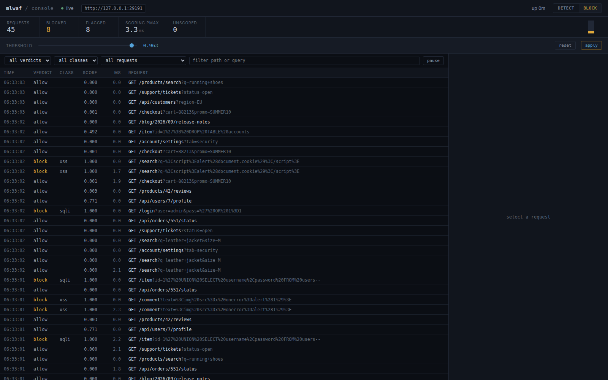
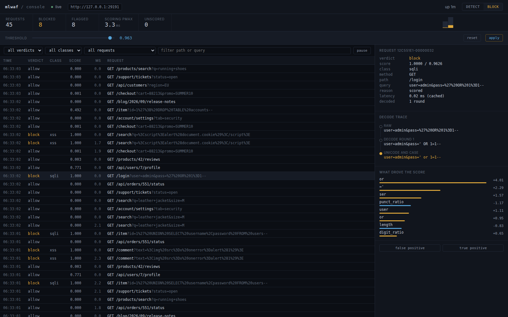
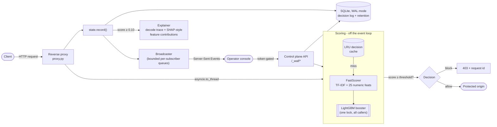
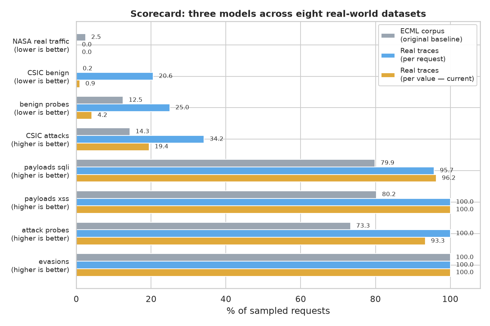

<div align="center">

# ML WAF

### A machine-learned web application firewall that catches SQL injection and XSS in real HTTP traffic - and is honest about what it misses

[](https://github.com/Abdelkrim7Be/ML_Trained_Firewall_For_Web_Apps/actions/workflows/ci.yml)


</div>

---

```
$ mlwaf predict "/item?id=1%27+UNION+SELECT+password+FROM+users--"
BLOCK  attack_score=1.0000  threshold=0.6764   worst_unit=query:id
  sqli  1.0000

$ mlwaf predict "/account" --method POST --body "name=O'Brien&city=Cork"
ALLOW  attack_score=0.0000  threshold=0.6764   worst_unit=body:name
  benign  1.0000
```

That second line is the whole point. It contains an apostrophe, and an earlier
version of this project - and most WAFs built the way it was first built - block
it, along with a double-digit percentage of everything else legitimate users send.

This repository is two things in one: a supervised classifier that decides
whether an HTTP request is `benign`, `sqli`, or `xss`, and a reverse proxy that
puts that classifier inline in front of a real application, with an operator
console to watch it work and a paper trail showing every wrong turn it took to
get here.

## Contents

- [See it work](#see-it-work)
- [Architecture](#architecture)
- [How detection works](#how-detection-works)
- [Results: read this before the numbers](#results-read-this-before-the-numbers)
- [The journey: three corpora, three architectures](#the-journey-three-corpora-three-architectures)
- [Data](#data)
- [Testing](#testing)
- [Reliability hardening](#reliability-hardening)
- [The console](#the-console)
- [Getting started](#getting-started)
- [Project layout](#project-layout)
- [Limitations](#limitations)
- [Where this started](#where-this-started)

---

## See it work

The operator console streams every decision live, with the score, the class,
and - for anything interesting - the full decode trace and the exact n-grams
that drove the verdict.



Selecting a blocked request shows why: the normalisation chain that peeled the
payload back to its canonical form, and LightGBM's exact per-feature
contributions.



No framework, no build step - `console/app.js` is under 400 lines of plain JS
against a JSON API, dark and dense on purpose. A console that celebrates every
row with colour teaches an operator to stop reading it; the one accent colour
here (amber) means exactly one thing: **blocked**.

## Architecture



Everything under `/_waf` - the console, its API, `/metrics`, `/healthz` - shares
the same port and process as the proxy, on purpose: one thing to deploy. Every
route under `/_waf` other than liveness/readiness requires a bearer token
(`WAF_ADMIN_TOKEN`), because a WAF whose off-switch is a single unauthenticated
`POST` is a cheaper attack than evading the classifier.

## How detection works

```
HTTP request
   ↓
normalise      recursive URL-decode → HTML entities → JS escapes →
               data: URI base64 → unicode NFKC → strip SQL comments →
               decode hex literals and CHAR() calls
   ↓
decompose      the request into independently-scoreable units:
               path, and every query/body/JSON-leaf parameter value
   ↓
features       char n-grams (3-5, TF-IDF)  +  25 numeric features,
               per unit
   ↓
LightGBM       P(benign), P(sqli), P(xss), per unit
   ↓
decision       block if 1 − P(benign) ≥ threshold, for the worst unit
```

**Normalisation comes first.** None of these are visible to a naive character
count, and every one is unwrapped before a feature is ever computed:

| Sent | Naive view | After normalisation |
|---|---|---|
| `%2527%2520OR%25201%3D1` | no quote | `' OR 1=1` |
| `&#60;script&#62;` | no angle bracket | `<script>` |
| `` | no angle bracket | `` |
| `un/**/ion sel/**/ect` | no keyword | `union select` |
| `CHAR(0x61,0x64,0x6d)` | opaque | `adm` |
| `＜script＞` (fullwidth) | no angle bracket | `<script>` |

**Scoring happens per value, not per request.** A request is mostly context -
the path, the parameter names, whatever sits next to the payload - and none of
that is the attack. Scoring the request as a whole taught earlier versions of
this model the vocabulary of whatever site trained it rather than the shape of
an injection (the whole subject of [the journey](#the-journey-three-corpora-three-architectures)
below). Scoring `modo=insertar`, `precio=8456`, and `id=1' OR 1=1--` as three
independent values, and taking the worst, means the first two can never leak
into the third.

**Serving is not training.** Scoring one request through the full sklearn
pipeline costs ~200ms - unusable inline, since pandas construction and
sklearn's input validation cost the same whether the batch holds one row or
three thousand. `waf/scorer.py` extracts the fitted vectoriser, scaler,
selection mask and booster and calls them directly on raw numpy/scipy
structures. Identical scores, asserted to `1e-12` in `tests/waf/test_scorer.py`.

## Results: read this before the numbers

This repository reports recall well below 0.99. Search GitHub for "ML WAF" and
most projects report 0.99+, so it's worth being explicit about where the gap
comes from - these are the four shortcuts that turn 0.80 into 0.99 without
improving a model at all, and whether this project takes them:

| Shortcut | What it does | Taken here? |
|---|---|---|
| Labels derived from the features | Model relearns a rule you wrote; accuracy approaches 100% by construction | No - ground-truth labels, real traces |
| Random split without dedup | Near-identical rows land on both sides; the test set is half memorised | No - deduped before splitting (36,031 CSIC duplicates alone) |
| Benign and attacks from different corpora | Model learns which *dataset* a row came from, not the attack | No - same corpus, same paths, both labels |
| Threshold picked on the test set | Operating point chosen using the answers | No - fitted on validation, applied unchanged |

The earlier version of this project took the first shortcut; [`POSTMORTEM.md`](POSTMORTEM.md)
has the arithmetic. Every number below is measured against a test split scored
once, plus checks the model was never tuned on.

### The scorecard: three models, eight real-world datasets

One number at a time misled this project more than once (see the journey
below). `mlwaf.scorecard` scores every model on every dataset at once.



| Dataset | ECML baseline | Real traces, per request | **Real traces, per value (shipped)** |
|---|---|---|---|
| NASA real traffic - false positives | 2.48% | 0.00% | **0.00%** |
| CSIC benign, unseen site - false positives | 0.20%¹ | 20.56% | **0.92%** |
| Adversarial benign probes - false positives | 12.50% | 25.00% | **4.17%** |
| SQL injection payloads - blocked | 79.87% | 95.70% | **96.24%** |
| XSS payloads - blocked | 80.25% | 100% | **100%** |
| Classic attack probes - blocked | 73.33% | 100% | 93.33% |
| Obfuscated evasions - blocked | 100% | 100% | **100%** |

¹ Looks best in this row and isn't: the ECML model blocks 14% of CSIC's
anomalous traffic and 80% of community payloads. It isn't discriminating, it's
declining to act - see [`docs/FINDINGS.md`](docs/FINDINGS.md#a-metric-of-mine-that-was-wrong).

**What's shipped today is the right column** - `models/model.joblib` is the
per-value, real-trace model. `models/model_ecml.joblib` is the original
baseline, kept for exactly the comparisons on this page.

### What's left, stated rather than hidden

Two narrow, understood gaps survive in the shipped model:

- **`nombre=libel` scores 1.000.** The n-gram `" li"` shares a feature with
  SQL's `LIKE` and HTML's `<link>`. A plain `char` analyser was tried instead
  of `char_wb` to remove the collision - false positives on CSIC went from
  1.07% to 6.23% and SQLi precision fell from 0.86 to 0.61, so it was reverted.
- **`admin'#` scores 0.187 and is allowed.** Seven characters, no body. Scoring
  values in isolation is what makes the model site-independent, and it's also
  what leaves a very short payload with too little to go on.

Full write-up of both, and everything else this project got wrong on the way
here, in [`docs/FINDINGS.md`](docs/FINDINGS.md) - genuinely the most useful
document in this repository.

## The journey: three corpora, three architectures

The short version, in the order it was actually discovered:

1. **Trained on ECML/PKDD 2007**, the only public corpus with full HTTP
   requests *and* per-request attack labels. Its benign URLs were sanitised
   into random strings during release; its attack payloads were left intact.
   Result: **the model learned that the literal token `users` means attack**,
   because in its training data a real English word appeared almost nowhere
   else. `/users/42/profile` - about as ordinary a URL as exists - scored
   0.9996 and was refused, while `1' OR 1=1--`, the single most recognisable
   SQL injection payload there is, scored 0.481 and got through.
2. **Benchmarked against the NASA-HTTP trace**, two months of real 1995 traffic
   to a public web server. False positives jumped from a reported 0.1% to a
   measured **1.60%**, and the tokens driving it were `shuttle`, `missions`,
   `sts` - the vocabulary of a website about space shuttles, nothing to do
   with SQL. Same bug, different words.
3. **Rebuilt the corpus from real web-server traces** instead of a sanitised
   academic one: same paths carry both a benign and an attack label, so a
   token like `shuttle` or `users` appears equally on both sides and carries
   no signal. False positives on real traffic: 339 → 9 (**38× fewer**), and
   recall improved *at the same time* - proof the model was never short of
   capacity, only of an example of what ordinary traffic looks like.
4. **Discovered parameter-padding evaded even the fixed model**: two hundred
   junk query parameters diluted a real injection's signal below threshold.
   Fixed by decomposing the request into independently-scored values (point 5
   below), which also, incidentally, made a `CSIC` recall number this project
   had been quoting as a weakness turn out to be measuring the wrong thing -
   CSIC's "anomalous" class is mostly parameter tampering and typos, not SQLi
   or XSS, and a two-class detector correctly ignores it.
5. **Landed on per-value scoring**: score every parameter, header-free and
   context-free, and take the worst. Fixes the padding evasion outright (each
   parameter is scored alone, so there's nothing left to dilute), and this is
   the model shipped today.
6. **Promoting it to production exposed a new, narrower issue**: scoring one
   value costs ~1.5ms, so scoring dozens of them per request needs a real
   latency budget, not the 25ms tuned for the old one-shot model. Fixed by
   capping units scored per request at 64 and raising the scoring deadline to
   180ms - bounding the tradeoff instead of hiding it. Full details in the
   [reliability hardening](#reliability-hardening) section below.

Every one of these was found by testing the firewall the way it's actually
used - against real traffic and under real concurrency - rather than trusting
a held-out slice of the same corpus it trained on. That gap between "scores
well on its own test set" and "survives contact with a real site" is the
throughline of this entire project, and [`docs/FINDINGS.md`](docs/FINDINGS.md)
is the whole story, numbers included.

## Data

| Source | Rows | Role |
|---|---|---|
| [ECML/PKDD 2007 Discovery Challenge](http://www.lirmm.fr/pkdd2007-challenge/index.html) | 14,507 labelled | original training corpus; later understood to be the cause of the vocabulary bug above |
| Four public web-server traces, recombined by `mlwaf.synth` | ~5,000,000 requests | current training corpus - same paths carry both labels, so vocabulary carries no signal |
| [CSIC 2010](https://www.tic.itefi.csic.es/dataset/) | 25,060 | independent corpus, generalisation + real benign-traffic check |
| [NASA Kennedy Space Center HTTP trace](https://ita.ee.lbl.gov/html/contrib/NASA-HTTP.html) | 21,167 distinct | real, unlabelled 1995 production traffic - the check no corpus metric could substitute for |
| Community payload lists, incl. [libinjection](https://github.com/libinjection/libinjection)'s bypass corpus | 2,695 | attack recall, assembled by people with no interest in this model looking good |

Reproduce the pipeline:

```sh
make install     # uv venv + deps
make data        # download corpora, parse, dedupe
make synth       # build the real-trace training corpus
make train-synth # train on it
make evaluate    # robustness, errors, external benchmark, adversarial, plots
```

## Testing

**200 tests**, four layers, each answering a different question:

| Layer | Count | Answers |
|---|---|---|
| `tests/test_*.py` | 36 | Is the model's own pipeline - parsing, features, evasion transforms - correct? |
| `tests/waf/` | 54 | Do the engine, proxy, and control plane work in isolation, in-process? |
| `tests/e2e/test_full_stack.py` | 58 | Against a real running server: does it protect the origin, stay usable, explain itself? |
| `tests/e2e/test_hardening.py` | 34 | Against a real server, adversarially: auth bypass, injection in every place a request can carry one, concurrent config changes |
| `tests/e2e/test_endurance.py` | 18 | Under sustained concurrent load, over time: does it stay correct, stay fast, and not leak memory or disk? |

```sh
make test    # unit + integration, 90 tests, ~10s
make e2e     # end to end, starts real server processes, 110 tests, ~1min
```

The last layer is the one that found the two most serious defects fixed in
this session - see below.

## Reliability hardening

An earlier pass over this project answered "is the model any good?" This one
answered "does the *system* survive concurrency?", and the answer, twice, was
no - silently, which is worse than a crash.

**A shared cache mutated from every scoring thread with no lock.** Scoring runs
via `asyncio.to_thread`, one thread per concurrent request. The decision cache
is a plain `OrderedDict`; two threads calling `move_to_end`/`popitem` on it at
once can corrupt its internal linked list rather than raise an exception -
which surfaces as the request simply never completing. Fixed with a
`threading.Lock` around every cache and stats access.

**LightGBM's booster is not safe to call from multiple native threads at
once**, even with `num_threads=1` per call. Under load, `scorer.py` and
`explain.py` both call into the same booster object from different threads
simultaneously, and the failure is the same shape: a hang inside native code.
Fixed with one lock shared between both call sites - a predict call costs
about 1.5ms, so serialising it costs nothing at this scale.

**Per-value scoring's own latency was invisible to the defaults it inherited.**
Scoring 100 parameters at ~1.5ms each is 150ms; the budget carried over from
the old one-shot model was 25ms. Past budget, a request is allowed through
unscored by design (a broken model must not become an outage) - which meant an
*ordinary* multi-field form could silently stop being scored at all. Fixed by
capping scored units at 64 and raising the budget to 180ms, turning an
unbounded, budget-dependent blind spot into a small, fixed, documented one (a
request needs 63+ parameters ahead of its payload to evade it, reproducibly,
instead of "somewhere between 150 and 400 depending on load").

Both concurrency fixes were verified by reproducing the hang, applying the
fix, and rerunning the same load repeatedly clean. Full account, including how
each was actually found, in [`docs/FINDINGS.md`](docs/FINDINGS.md).

**What the reverse proxy already does right**, independent of this pass:
detect mode by default (a WAF that blocks on day one gets switched off after
one false positive), fail-open on a scoring error or timeout, a 1MB cap on
bodies read for scoring, non-root container, structured JSON logs with a
request id, graceful drain on shutdown, and a `/metrics` endpoint.

## The console

Every decision keeps its score, not just its verdict, which is what makes the
threshold slider possible: moving it recomputes verdicts over real recent
traffic and shows the impact before anything is applied. Feedback recorded
against a decision (`false positive` / `true positive`) is appended to a file
in exactly the shape the training pipeline reads, so the loop back to the
model is a file, not an integration.

```sh
docker compose up --build
```

| URL | What it is |
|---|---|
| `http://localhost:8080` | your application, behind the firewall |
| `http://localhost:8080/_waf` | the operator console |
| `http://localhost:3000` | the application directly, for comparison |

The [sqlmap walkthrough in `docs/DEMO.md`](docs/DEMO.md) points a real scanner
at both.

## Getting started

```sh
make install     # uv venv + deps
make train       # rule baseline, logistic regression, LightGBM
make test        # 90 tests, ~10s
mlwaf predict "/item?id=1%27+OR+1%3D1--"
```

Run the firewall standalone:

```sh
WAF_UPSTREAM=http://localhost:3000 WAF_MODE=block python -m mlwaf.waf.app
```

Explore the data and model interactively:

```sh
make notebook    # notebooks/01_data_and_model.ipynb
```

## Project layout

```
src/mlwaf/
  download.py, parse.py, decode.py     fetch, structure, normalise raw requests
  features.py, units.py                char n-grams + numeric features; request decomposition
  dataset.py, synth.py                 labelling/dedupe; the real-trace corpus builder
  model.py, train.py, evaluate.py      candidates, fitting, calibrated metrics
  evasion.py, robustness.py,
  adversarial.py, external.py          obfuscation transforms and what survives them
  scorecard.py                         every model, every dataset, one view
  cli.py                               mlwaf <download|dataset|train|plots|predict>
  waf/
    proxy.py       the reverse proxy - the catch-all route
    engine.py       cache, decision policy, unit-decomposition dispatch
    scorer.py       the fast serving path (no pandas, no sklearn validation)
    explain.py       decode trace + SHAP-style feature contributions
    store.py         SQLite decision log, WAL mode, retention
    state.py, api.py  shared app state; the control plane
    console/          the operator UI - no framework, no build step
notebooks/        exploration only, never runtime
models/           model.joblib (shipped) + model_ecml.joblib (baseline) + MODEL_CARD.md
reports/          metrics, scorecard, figures - all generated, none hand-edited
docs/
  FINDINGS.md      the debugging journey in full - start here
  USAGE.md, DEMO.md, WAF_PLAN.md
```

## Limitations

- **Per-request only.** No session state, so slow or distributed attacks that
  look benign one request at a time are invisible to it.
- **Two attack classes trained** (`sqli`, `xss`); five more are measured but
  not detected.
- **Fixed transform catalogue, not an adaptive attacker.** Robustness numbers
  are a floor, not a ceiling - they say nothing about a genetic-mutation
  fuzzer such as WAF-A-MoLE.
- **A parameter count above 64, with the payload placed after it, is not
  scored** - see [reliability hardening](#reliability-hardening). Pair with a
  gateway-level parameter limit for defense in depth.
- **Single process.** The console's live stream and decision cache are per
  process; scaling past ~80 rps means running several behind a load balancer,
  each with its own console view, until the event bus and cache move out of
  process.
- Two narrow, understood scoring gaps remain - see
  [results](#results-read-this-before-the-numbers) above.

See [`models/MODEL_CARD.md`](models/MODEL_CARD.md) for the full card on the
original baseline model, kept for comparison.

## Where this started

This began as an end-of-studies project (PFE) at **ESTM - École Supérieure de
Technologie de Meknès**, Morocco: `Notebooks_jupyter/` still holds the original
work. It trained unsupervised KMeans clustering over six hand-counted features
(`single_q`, `double_q`, `dashes`, ...) to sort requests into "good" and "bad"
clusters, and wired the result into a proxy that logged an intrusion and then
forwarded the request anyway:

```python
if result['Cluster'][0] == "Cluster 1":
    print('Intrusion Detected !')
# ...forwarded regardless. No async, no tests, no explainability,
# GET paths only - POST bodies, where most SQLi actually travels,
# were never inspected at all.
```

Everything in this repository - the supervised multi-class model, the
real-trace corpus, per-value scoring, the async reverse proxy with an
explainable operator console, the 200-test suite, and the reliability fixes
above - is the rebuild that followed, done properly and documented as it went,
including every wrong turn. `tests/waf/test_proxy.py` asserts the most basic
difference directly: the fake upstream records every request it receives, and
after a real attack, it's empty.

The rebuild was done with Claude (Anthropic) as a pair-programming and
debugging partner throughout, most recently for the concurrency fixes and
model promotion in [reliability hardening](#reliability-hardening). Worth
saying plainly rather than leaving to guesswork.

---

<div align="center">

See [`docs/FINDINGS.md`](docs/FINDINGS.md) for the full debugging history, and
[`docs/USAGE.md`](docs/USAGE.md) / [`docs/DEMO.md`](docs/DEMO.md) for driving
the running system.

</div>
