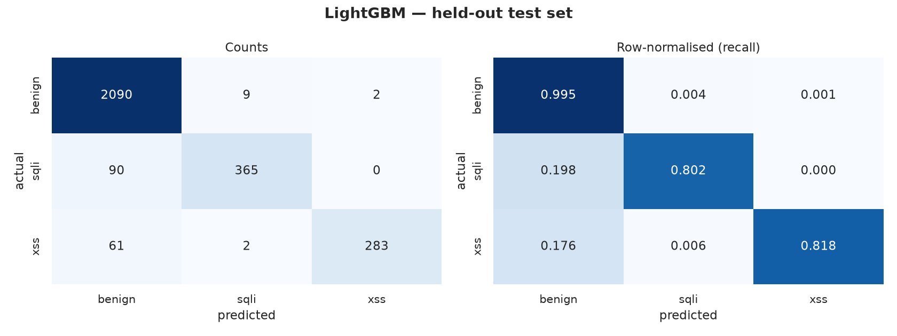

# ML WAF: SQL injection and XSS detection in HTTP requests

A supervised classifier that reads a full HTTP request, method, path, query and
body, and decides whether it is benign, SQL injection, or XSS. Built to sit inline
in a reverse proxy and refuse the requests it flags.

```
$ mlwaf predict "/item?id=1%27+UNION+SELECT+password+FROM+users--"
BLOCK  attack_score=1.0000  threshold=0.9626   sqli 1.0000

$ mlwaf predict "/search?q=%3Cimg+src%3Dx+onerror%3Dalert%281%29%3E"
BLOCK  attack_score=1.0000  threshold=0.9626   xss  1.0000

$ mlwaf predict "/account" --method POST --body "name=O'Brien&city=Cork"
ALLOW  attack_score=0.0056  threshold=0.9626   benign 0.9944
```

That last one is the point. It contains an apostrophe, so the previous version of
this project blocked it, along with **52% of all legitimate traffic**.

## Two corpora, and why it matters

This project trains the same model twice. Once on ECML/PKDD 2007, the published
academic corpus, and once on a corpus built from four public web server traces.
The comparison is the point of the repository.

| Measured on real traffic and outside payloads | ECML | Real traces |
|---|---|---|
| **False positives**, 21,167 real requests | 339, **1.60%** | 9, **0.0425%** |
| SQL injection recall, 759 community payloads | 0.784 | **0.953** |
| XSS recall, 1,936 community payloads | 0.826 | **0.997** |
| Recall on unseen attack types | 0.209 | **0.760** |

Thirty eight times fewer false positives, and better recall at the same time. Not
a threshold trade, and not a better algorithm: the same pipeline, trained on data
where benign traffic actually looks like benign traffic.

```
                                    ECML model      corpus model
/users/42/profile                   0.9996 BLOCK    0.0000 allow
/shuttle/missions/sts-78/news/      0.9995 BLOCK    0.0000 allow
id=1' OR 1=1--                      0.5122 allow    1.0000 BLOCK
id=1' AND SLEEP(5)--                0.1819 allow    1.0000 BLOCK
```

The story of how the first model came to block `/users/42/profile` while allowing
the most famous SQL injection payload there is, and how it was found, is in
[`docs/FINDINGS.md`](docs/FINDINGS.md). It is the most useful thing here.

## Read this before the numbers

This repository reports **0.80 recall** at a 0.1% false-positive rate. Search GitHub
for "ML WAF" and you will find a hundred projects reporting 0.99, so it is worth
being explicit about where the difference comes from. Reproduced here, in order,
are the four things that turn 0.80 into 0.99 without improving a model at all:

| Shortcut | What it does | Taken here? |
|---|---|---|
| Labels derived from the features | Model relearns a rule you wrote; accuracy approaches 100% by construction | No, labels are ECML/PKDD ground truth |
| Random split without dedup | Near-identical rows land on both sides; the test set is half memorised | No, deduped before splitting (CSIC alone had 36,031 duplicates) |
| Benign and attacks from different corpora | Model learns which *dataset* a row came from | No, one corpus, and the confound is measured (separability **1.000**) |
| Threshold picked on the test set | Operating point chosen using the answers | No, fitted on validation, applied unchanged |

The previous version of this project took the first shortcut, and
[`POSTMORTEM.md`](POSTMORTEM.md) shows the arithmetic: its labels were a
deterministic function of its own six features across all 45,233 rows, so its model
could only rediscover a rule already written by hand, and it recovered it badly,
catching 52% of attacks.

Every number below is measured against a test split scored exactly once, plus three
independent checks the model was never tuned on: five attack types held out of
training, a separate 2010 corpus, and 646 third-party obfuscated payloads.

---

## Results

Trained on 14,507 labelled HTTP requests from ECML/PKDD 2007. The test split is
scored once, at the end.

### Model comparison (validation set)

| Model | macro-F1 | PR-AUC | SQLi recall | XSS recall | recall @ FPR | achieved FPR | ms/req |
| --- | --- | --- | --- | --- | --- | --- | --- |
| Rule baseline (v0 heuristic) | 0.335 | 0.392 | 0.932 | 0.000 | 0.920 | 0.522 | 0.01 |
| LogReg + char n-grams | 0.909 | 0.906 | 0.804 | 0.821 | 0.799 | 0.001 | 0.88 |
| **LightGBM + n-grams + numeric** | 0.916 | 0.908 | 0.829 | 0.824 | 0.811 | 0.001 | 1.01 |

### Final model, held-out test set

| Class | Precision | Recall | F1 | Support |
| --- | --- | --- | --- | --- |
| `benign` | 0.933 | 0.995 | 0.963 | 2101 |
| `sqli` | 0.971 | 0.802 | 0.878 | 455 |
| `xss` | 0.993 | 0.818 | 0.897 | 346 |

### Operating points

| FPR budget | Threshold | Recall | Precision | Achieved FPR | False blocks |
| --- | --- | --- | --- | --- | --- |
| 0.1% | 0.9165 | 0.803 | 0.997 | 0.10% | 2 / 2101 |
| 0.5% | 0.5431 | 0.811 | 0.985 | 0.48% | 10 / 2101 |
| 1.0% | 0.3925 | 0.814 | 0.969 | 1.00% | 21 / 2101 |

### Generalisation

- Unseen attack types (never trained on): **0.209** (2029/9724)
- CSIC 2010, separate corpus: recall **0.147**, FPR 0.003
- Corpus discrimination accuracy: **1.000**



The rule baseline row is the honest headline. It is v0's heuristic, flag anything
containing a quote, dash, paren, space or SQL keyword, and it catches 93% of SQL
injection. It also blocks **52% of legitimate traffic**, and has no concept of XSS
at all, which is why its macro-F1 is 0.335. Beating it is not about finding more
attacks; it is about not destroying the site in the process.

Note what the generalisation numbers say. Recall on the five attack types held out
of training is 0.209, and on CSIC 2010 it is 0.147, both far below the 0.803 on
matched traffic. The corpus discrimination check explains the second one: a
throwaway classifier separates ECML from CSIC requests with **1.000** accuracy, so
the two corpora share almost no surface structure and that number measures domain
shift, not detection skill. Reporting it beats quietly hoping nobody checks.

## Robustness to obfuscation

Recall on clean corpus payloads answers a question no attacker asks. Every attack
the model catches is rewritten by thirteen transforms that preserve what the
payload does but change how it looks, and counted again.

| Transform | Family | Bypass before | Bypass after | Change |
| --- | --- | --- | --- | --- |
| `case_flip` | encoding | 0.0% | 0.0% | ,  |
| `url_encode` | encoding | 0.1% | 0.0% | ,  |
| `double_url_encode` | encoding | 0.3% | 0.3% | ,  |
| `html_entity_encode` | encoding | 0.0% | 0.0% | ,  |
| `js_unicode_escape` | encoding | 0.1% | 0.0% | ,  |
| `fullwidth` | encoding | 0.0% | 0.0% | ,  |
| `mysql_version_comment` | sql syntax | ,  | 0.0% | new |
| `space_to_comment` | sql syntax | 20.5% | 0.0% | -20.5% |
| `space_to_tab` | whitespace | 4.8% | 0.0% | -4.8% |
| `space_to_newline` | whitespace | 5.1% | 0.0% | -5.1% |
| `char_function` | literal | 6.5% | 1.4% | -5.1% |
| `hex_literal` | literal | 35.1% | 6.7% | -28.4% |
| `concat_quotes` | literal | 0.0% | 0.0% | ,  |

The `encoding` family is what the normalisation chain exists to undo, so a non-zero
bypass there is a bug in `decode.py`, not a property of the model. That is how the
chain is tested, and how three real defects were found and fixed:

| Defect | Symptom | Cost |
|---|---|---|
| Comments deleted instead of spaced | `union/**/select` → `unionselect`, destroying the n-gram | 20.5% bypass |
| Hex literals never decoded | `0x61646d696e` left as-is | 35.1% bypass |
| `CHAR()` pattern written `chr?` | matched `ch`/`chr`, never `char` | 6.5% bypass |

A fourth finding was about the harness rather than the model: the `hex_literal`
transform was matching across stray apostrophes in ECML's sanitised noise and
hex-encoding entire query strings, separators included, payloads no attacker would
ever send. Constraining it to literals of at most 32 characters containing no `&`
or `=` made it realistic, and the measured bypass fell from 28.7% to 6.7%.

## Adversarial training

Obfuscated copies of the attack rows are added to the training set. The transforms
are split four/nine: the model trains on four and is scored on nine it has never
seen, so the result measures generalisation rather than memorisation.

| Transform | Seen in training | Recall before | Recall after | Change |
| --- | --- | --- | --- | --- |
| `case_flip` | yes | 0.801 | 0.803 | +0.001 |
| `url_encode` | yes | 0.804 | 0.804 | +0.000 |
| `space_to_tab` | yes | 0.801 | 0.803 | +0.001 |
| `char_function` | yes | 0.790 | 0.805 | +0.015 |
| `double_url_encode` | **no** | 0.798 | 0.796 | -0.001 |
| `html_entity_encode` | **no** | 0.801 | 0.804 | +0.003 |
| `js_unicode_escape` | **no** | 0.804 | 0.804 | +0.000 |
| `fullwidth` | **no** | 0.803 | 0.803 | +0.000 |
| `mysql_version_comment` | **no** | 0.801 | 0.803 | +0.001 |
| `space_to_comment` | **no** | 0.801 | 0.803 | +0.001 |
| `space_to_newline` | **no** | 0.801 | 0.803 | +0.001 |
| `hex_literal` | **no** | 0.748 | 0.749 | +0.001 |
| `concat_quotes` | **no** | 0.803 | 0.803 | +0.000 |

**It barely moves the needle** ,  between +0.000 and +0.015. That is the honest
result, and it is explainable: normalisation already rewrites these payloads to
their canonical form before the model ever sees them, so the augmented rows are
near-duplicates of the originals. Adversarial training is worth having as
defence-in-depth for obfuscations the normaliser does not know about, but on this
transform set the normaliser is doing essentially all of the work.

## What it misses

|  | Caught | Missed |
| --- | --- | --- |
| Median length | 291 | 221 |
| Median decode depth | 1.0 | 0.0 |
| Share with a body | 0.131 | 0.431 |
| Median SQL keywords | 1.0 | 0.0 |
| Median XSS keywords | 1.0 | 0.0 |

Miss rate by class: sqli 21.5%, xss 17.9%.

Two things stand out. Missed attacks have a median SQL/XSS keyword count of zero
and a decode depth of zero, they carry no obvious signal at all. And they are
three times more likely to carry a POST body.

The body finding looked like a modelling problem, so URL and body were given
separate n-gram spaces on the theory that a long body dilutes a short payload. It
did not work: the miss rate for requests with a body was unchanged and held-out
attack recall fell from 0.34 to 0.21, so the change was reverted. The likelier
explanation is the corpus. ECML's sanitisation buried attack tokens inside random
strings (`ntcebetween4oaenq`, `ghaving`), leaving little to recover.


---

## How it works

```
HTTP request
   ↓
normalise      recursive URL-decode → HTML entities → JS escapes →
               data: URI base64 → unicode NFKC → strip SQL comments
   ↓
features       char n-grams (3-5, TF-IDF)  +  25 numeric features
   ↓
LightGBM       P(benign), P(sqli), P(xss)
   ↓
decision       block if 1 − P(benign) ≥ threshold
```

### Normalisation comes first

Payloads do not arrive in the clear. Each of these is invisible to a naive
character count, and each is handled before features are computed:

| Sent | Naive view | After normalisation |
|---|---|---|
| `%2527%2520OR%25201%3D1` | no quote | `' OR 1=1` |
| `&#60;script&#62;` | no angle bracket | `<script>` |
| `\u003cimg src=x\u003e` | no angle bracket | `` |
| `un/**/ion sel/**/ect` | no keyword | `union select` |
| `＜script＞` (fullwidth) | no angle bracket | `<script>` |

The number of decoding rounds a request needed is kept as a feature. Ordinary
traffic needs zero or one.

### Why character n-grams

The previous version counted six things: quotes, double quotes, dashes, parens,
spaces, SQL keywords. Those counts cannot separate a surname from an auth bypass:

| Request | `single_q` | verdict under counting |
|---|---|---|
| `q=O'Brien` | 1 | identical |
| `q=admin' OR 1=1` | 1 | identical |

Character n-grams see `' or` and `nion sel` as features in their own right. The
counters are kept alongside, they are cheap, and they make the feature
importance plot readable, but they are no longer the whole model.

### Choosing the threshold

The model emits a probability; `0.5` is an arbitrary place to cut it. A WAF that
blocks 1% of real traffic is unusable, so the operating point is chosen by fixing
a false-positive budget on validation data and reading off the recall that budget
buys. The threshold is never tuned on the test set.

---

## Data

[ECML/PKDD 2007 Discovery Challenge](http://www.lirmm.fr/pkdd2007-challenge/index.html),
mirrored by [msudol/Web-Application-Attack-Datasets](https://github.com/msudol/Web-Application-Attack-Datasets).
It is the only public corpus with full HTTP requests *and* per-request attack
type labels.

| Split | Rows | Purpose |
|---|---|---|
| `benign` / `sqli` / `xss` | 14,507 | train / validate / test (60-20-20 stratified) |
| 5 other attack types | 9,724 | never trained on, generalisation check |
| CSIC 2010 | 25,060 | independent corpus, second generalisation check |

Three deliberate choices:

1. **Labels are ground truth, not derived.** v0 generated its labels with a rule
   over the same six features it then trained on, making the task circular. Here
   the attack type comes from the challenge organisers.
2. **Both classes come from one corpus.** Benign from dataset A and attacks from
   dataset B teaches a model to recognise the dataset, not the attack. A
   corpus-discrimination check is reported below to show how separable the two
   corpora are, so the cross-corpus number can be read honestly.
3. **Duplicates are removed before splitting.** Near-identical rows straddling the
   split leak the answer; CSIC alone contained 36,005 exact duplicates.

---

## Reproduce

```sh
make install     # uv venv + deps
make data        # download corpora, parse, dedupe   (~40 MB)
make train       # train all three models, write reports/metrics.json
make evaluate    # robustness, errors, external benchmark, adversarial, plots, tables
make test        # 36 tests
```

`make all` runs the lot. Two evaluations are deliberately separate because they are
slow and only needed when changing the design rather than the code:

```sh
make stability   # refit every candidate across 5 seeds, report mean ± std
make adversarial # retrain on obfuscated payloads, score on held-out transforms
```

Score a single request:

```sh
mlwaf predict "/item?id=1%27+UNION+SELECT+password+FROM+users--"
mlwaf predict "/account" --method POST --body "name=O'Brien&city=Cork"
```

Explore the data and model interactively:

```sh
make notebook    # notebooks/01_data_and_model.ipynb
```

---

## Layout

```
src/mlwaf/
  download.py     fetch the corpora
  parse.py        raw HTTP blocks → structured requests
  decode.py       the normalisation chain
  features.py     char n-grams + 28 numeric features
  dataset.py      labelling, dedupe, held-out splits
  model.py        rule baseline, logistic regression, LightGBM
  train.py        fit, compare, select threshold, persist
  evaluate.py     metrics, including calibration
  evasion.py      13 obfuscation transforms, 4 families
  robustness.py   recall decay per transform
  adversarial.py  train on 4 transforms, score on 9 held out
  external.py     third-party obfuscated payload benchmark
  errors.py       what the model misses, and whether it has a shape
  stability.py    refit across seeds; separates real gains from noise
  plots.py        report figures
  report.py       README tables, generated from the JSON
  cli.py          mlwaf <download|dataset|train|plots|predict>
notebooks/        exploration only, never runtime
models/           model.joblib + MODEL_CARD.md
reports/          metrics, tables, figures, all generated
```

Notebooks explore; `src/` runs. In v0 the notebooks *were* the runtime, which is
why nothing in it could be tested or deployed.

---

## Limitations

- ECML/PKDD 2007 is old, and its URLs and parameter values were randomised during
  sanitisation. Real traffic has structure this corpus does not.
- **Fixed transform catalogue, not an adaptive attacker.** The evasion suite
  applies thirteen hand-written obfuscations. It does not *search* for a bypass the
  way a genetic mutation tool such as WAF-A-MoLE does, so these numbers are a floor
  on robustness, not a ceiling.
- **Generalisation is the weak point.** 0.803 recall on matched traffic, 0.209 on
  attack types held out of training, 0.147 on a separate corpus. The last figure is
  heavily confounded by domain shift (corpus discrimination accuracy 1.000), but
  the first two are not, and the gap is real.
- Two attack classes are trained; five more are only measured.
- Per-request only, no session state, so slow or distributed attacks that look
  benign one request at a time are invisible.

See [`models/MODEL_CARD.md`](models/MODEL_CARD.md) for the full card.

## Part 2: the firewall

The classifier decides; the firewall acts. `src/mlwaf/waf/` puts the model inline
in a reverse proxy that refuses requests, with an operator console to see why.

```sh
docker compose up --build
```

| | |
|---|---|
| http://localhost:8080 | OWASP Juice Shop, behind the firewall |
| http://localhost:8080/_waf | the operator console |
| http://localhost:3000 | Juice Shop directly, for comparison |

```
$ curl -i "localhost:8080/rest/products/search?q=1%27+UNION+SELECT+1,2,3--"
HTTP/1.1 403 Forbidden
X-MLWAF-Action: block
{"error":"request_blocked","request_id":"f6d2367e-00000002"}
```

How to drive all of it: [`docs/USAGE.md`](docs/USAGE.md). The sqlmap walkthrough:
[`docs/DEMO.md`](docs/DEMO.md). Design and reasoning: [`docs/WAF_PLAN.md`](docs/WAF_PLAN.md).
What end to end testing exposed: [`docs/FINDINGS.md`](docs/FINDINGS.md).

### Every decision is explainable

Most firewalls answer "blocked" and stop, which leaves an operator unable to tell
an attack from a false positive. This one records how the payload came apart:

```
raw               id=1%2527%2520UNION%2520SELECT%2520password%2520FROM%2520users--
decode round 1    id=1%27%20UNION%20SELECT%20password%20FROM%20users--
decode round 2    id=1' UNION SELECT password FROM users--
unicode and case  id=1' union select password from users--
```

and which fragments drove the score, from LightGBM's exact per feature SHAP
values:

```
users  +1.44    uni  +0.84    lect  +0.82
```

### The threshold is a control, not a constant

Every stored decision keeps its score, so moving the console's threshold slider
recomputes verdicts over real recent traffic and reports what would change before
anything is applied. Part 1's false positive budget becomes something an operator
can feel rather than a number in a table.

### Serving is not training

Scoring one request through the training pipeline took about 200ms, which is
unusable inline: pandas construction and sklearn validation cost the same whether
the batch holds one row or three thousand. `waf/scorer.py` extracts the fitted
vectoriser, scaler, selection mask and booster and calls them directly.

| | per request |
|---|---|
| through the sklearn pipeline | ~274 ms |
| through the serving path | ~10 ms |

Identical scores, asserted to `1e-12` in `tests/waf/test_scorer.py`. Measured live
over 288 requests: mean **6.3 ms**, 99% under 10 ms, no timeouts.

### Production behaviour

- **Detect mode by default.** A WAF is rolled out by watching what it would have
  blocked, reviewing that queue, then enforcing. Shipping something that blocks on
  first run is how you get switched off after one false positive.
- **Fail open, and alert.** If scoring raises or exceeds its budget, the request is
  allowed and counted as unscored. A broken model must not become an outage.
  `WAF_FAIL_MODE=closed` inverts it.
- **Bounded bodies.** Read up to 1 MB for scoring, streamed through untouched
  beyond that. A proxy that buffers unbounded uploads is the outage it was meant
  to prevent.
- Non root container, readiness gated on a warmed model, Prometheus metrics,
  structured JSON logs with a request id, graceful drain.

### What end to end testing found

Part 1 scored the model against held out slices of its own corpus. Part 2 put it
in front of a web application and sent it the traffic a real site receives. That
exposed something no corpus metric did:

```
/users/42/profile        score 0.9996   REFUSED
/user/42/profile         score 0.265    allowed
/accounts/42/profile     score 0.003    allowed

id=1' OR 1=1--           score 0.481    allowed
id=1' OR 1=1-- users     score 0.992    REFUSED
```

**The model largely learned that the token `users` means attack.** ECML/PKDD was
sanitised before release, so its benign URLs are randomised strings while its
attack payloads were left intact. Real English words therefore appear almost only
inside attacks, and no split of that corpus can reveal the problem because the held
out benign traffic is randomised too.

Scored against the [NASA Kennedy Space Center HTTP trace](https://ita.ee.lbl.gov/html/contrib/NASA-HTTP.html),
two months of requests to a real public web server, the picture is worse and
clearer. **339 of 21,167 real requests were refused, a false positive rate of
1.60%** against the 0.1% the corpus reported. The words driving those refusals:

```
shuttle 336    missions 326    sts 287    images 87
movies   68    sounds    59    news  55    docs   39
```

Nothing to do with SQL injection. They are the words that appear in the URLs of a
website about space shuttles. The model treats any ordinary English word in a URL
as evidence of an attack, because in its training data that is the only place one
ever appeared.

Recall on 2,695 community payloads, including libinjection's bypass corpus, holds
at 0.78 for SQLi and 0.83 for XSS. So the model recognises attacks reasonably and
fails to recognise that ordinary traffic is not one.

It explains the part 1 numbers that looked merely disappointing: 0.147 recall
cross corpus, 0.209 on unseen attack types, corpus separability 1.000. Those were
symptoms; this is the mechanism. Full write up, including the payloads that get
through, in [`docs/FINDINGS.md`](docs/FINDINGS.md).

The firewall itself is fine: 57 end to end checks pass, covering blocking, origin
isolation, obfuscation, concurrency, restart persistence, graceful shutdown and
live streaming. The defect is in the data, which is why the fix is generating
realistic traffic rather than adding trees.

It is also the argument for every conservative default here. Enforcing this model
on a real site would refuse every URL containing `users`, and detect mode plus the
review queue surfaces that on the first afternoon at no cost.

### What v0 did instead

```python
if result['Cluster'][0] == "Cluster 1":
    print('Intrusion Detected !')
```

It printed, then forwarded the request anyway, and read GET paths only, so POST
bodies were never inspected. `tests/waf/test_proxy.py` asserts the difference: the
fake upstream records every request it receives, and after an attack it is empty.
